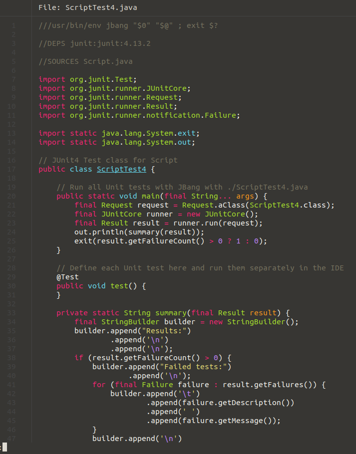

# jbang-catalog

My collection of [JBang](https://www.jbang.dev) scripts.
 
It contains various sample scripts and [JUnit 4 and 5 templates](#junit-templates) to help in writing tests for **JBang** scripts.

## Table of contents

### General
- [Install JBang](#install-jbang)
- [Generate the completion script for a JBang script](#generate-the-completion-script-for-a-jbang-script)

### JBang Scripts
- [Ssh](#ssh)
- [Sort](#sort)
- [Links](#links)
- [Html](#html)
- [SizeOf](#sizeof)
- [GitClone](#gitclone)
- [GitGet](#gitget)
- [WhatsNewInJava](#whatsnewinjava)
    + [Lists the changes made for `Stream` feature in Java 8 for `Iterable`, `Collection` and `List` classes](#lists-the-changes-made-for-stream-feature-in-java-8-for-iterable-collection-and-list-classes)
    + [Lists `Optional`, `Stream` and `Collectors` changes introduced since Java 8](#lists-optional-stream-and-collectors-changes-introduced-since-java-8)
    + [Lists the changes introduced to `java.nio.file` package in Java 8](#lists-the-changes-introduced-to-javaniofile-package-in-java-8)
    + [Lists the changes made to `java.lang.Process` in Java 9](#lists-the-changes-made-to-javalangprocess-in-java-9)
    + [Lists the classes having changed in Java 9 in the `java.time` package](#lists-the-classes-having-changed-in-java-9-in-the-javatime-package)
    + [List the changes made in Java 11 for strings](#list-the-changes-made-in-java-11-for-strings)
    + [List the `java.lang.Integer`, `java.lang.Long` ... methods made deprecated in Java 9](#list-the-javalanginteger-javalanglong--methods-made-deprecated-in-java-9)
    + [List the deprecated methods in package `java.util.concurrent.atomic`](#list-the-deprecated-methods-in-package-javautilconcurrentatomic)
    + [List the deprecated methods of `java.lang.Thread`](#list-the-deprecated-methods-of-javalangthread)
- [StatusCode](#statuscode)

### JBang Templates
- [JUnit 4 template](#junit-4-template)
- [JUnit 5 template](#junit-5-template)

## Install JBang

```sh
curl -Ls https://sh.jbang.dev | bash -s -
```

Then:

```sh
export PATH=$HOME/.jbang/bin:$PATH
```

## Generate the completion script for a JBang script

For example `WhatsNewInJava`:

```sh
jbang build WhatsNewInJava.java
java -classpath $(jbang info classpath WhatsNewInJava.java) picocli.AutoComplete -f -n whats-new-in-java WhatsNewInJava
sudo cp whats-new-in-java_completion /etc/bash_completion.d
```

## Ssh

A basic SSH client.

Written with Apache Mina, JBang and Picocli.

```sh
jbang ssh@grumpyf0x48 --help
```

```console
Usage: Ssh [-hV] [-a=<authenticationTimeout>] [-c=<connectionTimeout>]
           [-i=<identityFile>] [-p=<password>] [--port=<port>] <destination>
           [<command>...]
A basic SSH client
      <destination>    Destination to reach (format: user@hostname)
      [<command>...]   Command to execute and its parameters
  -a, --authentication-timeout=<authenticationTimeout>
                       Authentication timeout in seconds (default: 30)
  -c, --connection-timeout=<connectionTimeout>
                       Connection timeout in seconds (default: 30)
  -h, --help           Show this help message and exit.
  -i, --identity=<identityFile>
                       Identity file
  -p=<password>        Password
      --port=<port>    Port (default: 22)
  -V, --version        Print version information and exit.
```

### Sample use

```sh
jbang ssh@grumpyf0x48 -i ~/.ssh/id_rsa pi@192.168.0.108 ls /home
```

## Sort

A sample sort program to illustrate Java stream and Array sort use.

Written with JBang and Picocli.

```sh
jbang sort@grumpyf0x48 --help
```

```console
Usage: Sort [-himnrV] [<elements>...]
A sample sort program to illustrate Java stream and Array sort use
      [<elements>...]        Elements to sort
  -h, --help                 Show this help message and exit.
  -i, --ignore-case          Enable ignore case
  -m, --human-numeric-sort   Enable human numeric sort
  -n, --numeric-sort         Enable numeric sort
  -r, --reverse              Enable reverse sort
  -V, --version              Print version information and exit.
```

### Sample use

```sh
jbang sort@grumpyf0x48 -r -m $(exa -l ~/Downloads | cut -d " " -f 2 | xargs)
```

## Links

A program to retrieve the posts metadata of my former blog archived on https://web.archive.org.

Written with Jsoup, Gson, JBang and Picocli.

```sh
jbang links@grumpyf0x48 --help
```

```console
Usage: Links [-hvV] [-a=<archivedSiteUrl>] [-f=<firstPage>] [-l=<lastPage>]
             [-r=<rootUrl>] <file>
A program to retrieve the posts metadata of my former blog archived on https://web.archive.org
      <file>                 The output file
  -a, --archived-site-url=<archivedSiteUrl>
                             The URL of the archived web Site (default: http:
                               //blog.onkeyboardst.net)
  -f, --first-page=<firstPage>
                             First page to parse (default: 1)
  -h, --help                 Show this help message and exit.
  -l, --last-page=<lastPage> Last page to parse (default: 1)
  -r, --root-url=<rootUrl>   The root URL to parse on https://web.archive.org
                               (default: https://web.archive.
                               org/web/20200211042437)
  -v, --verbose              Enable verbose mode
  -V, --version              Print version information and exit.
```

### Sample use

```sh
jbang links@grumpyf0x48 -v -f 1 -l 4 firstPosts.json
```

## Html

A program to build the archive page for my new blog from the posts.json file generated by Links.

Written with Gson, JBang and Picocli.

```sh
jbang html@grumpyf0x48 --help
```

```console
Usage: Html [-hV] -i=<inputFile> -o=<outputFile>
A program to build the archive page for my new blog from the posts.json file generated by Links
  -h, --help         Show this help message and exit.
  -i=<inputFile>     The input file (.json)
  -o=<outputFile>    The output file (.html)
  -V, --version      Print version information and exit.
```

### Sample use

```sh
jbang html@grumpyf0x48 -i posts.json -o archive.html
```

## SizeOf

A program to display the memory size of Java primitive types and their corresponding wrapper classes.

Written with OpenJDK jol, JBang and Picocli.

```sh
jbang sizeof@grumpyf0x48 --help
```

```console
Usage: SizeOf [-hV] [<types>...]
A program to display the memory size of Java primitive types and their corresponding wrapper classes
      [<types>...]   The primitive types (default: byte, boolean, char, short,
                       int, float, long, double
  -h, --help         Show this help message and exit.
  -V, --version      Print version information and exit.
```

### Sample use

```sh
jbang sizeof@grumpyf0x48
```

```console
sizeof(byte)=1, sizeof(Byte)=16
sizeof(boolean)=1, sizeof(Boolean)=16

sizeof(char)=2, sizeof(Character)=16
sizeof(short)=2, sizeof(Short)=16

sizeof(int)=4, sizeof(Integer)=16
sizeof(float)=4, sizeof(Float)=16

sizeof(long)=8, sizeof(Long)=24
sizeof(double)=8, sizeof(Double)=24
```

## GitClone

A basic `git clone` replacement in Java.

Written with jGit, JBang and Picocli.

```sh
jbang git-clone@grumpyf0x48 --help
```

```console
Usage: GitClone [-hnV] [--bare] [-b=<branch>] [-i=<identityFile>] <repository>
                [<directory>]
A basic `git clone` replacement in Java
      <repository>        The repository to clone from
      [<directory>]       The name of a new directory to clone into
  -b, --branch=<branch>   Branch name
      --bare              Make a bare Git repository
  -h, --help              Show this help message and exit.
  -i, --identity=<identityFile>
                          Identity file in PEM format (default: ~/.ssh/id_rsa)
  -n, --no-checkout       No checkout of HEAD is performed after the clone is
                            complete
  -V, --version           Print version information and exit.
```

The SSH key should be in PEM format.

To convert a private key from OPENSSH to PEM format:

```sh
ssh-keygen -p -f ~/.ssh/id_rsa -m pem
```

### Sample use

```sh
jbang git-clone@grumpyf0x48 git@github.com:jbangdev/jbang.git /tmp/jbang
```

## GitGet

A command to get one or more files (or directories) from a Git repository.

Written with jGit, JBang and Picocli

It is like `git clone` but restricted to some files or directories of the repository.

```sh
jbang git-get@grumpyf0x48 --help
```

```console
Usage: GitGet [-hV] [--fresh] [-b=<branch>] [-i=<identityFile>] <repository>
              <directory> <paths>...
A command to get one or more files (or directories) from a Git repository
      <repository>        The repository to clone from
      <directory>         The name of a new directory where to store files
      <paths>...          The file or directory paths to get from the repository
  -b, --branch=<branch>   Branch name
      --fresh             Make a fresh clone of the repository
  -h, --help              Show this help message and exit.
  -i, --identity=<identityFile>
                          Identity file in PEM format (default: ~/.ssh/id_rsa)
  -V, --version           Print version information and exit.
```

### Sample use

```sh
jbang git-get@grumpyf0x48 git@github.com:jbangdev/jbang.git ~/jbang-files misc/ src/ readme.adoc
```

```console
ls -l ~/jbang-files
total 64
drwxrwxr-x 3 user user  4096 mars   7 08:24 misc
-rw-rw-r-- 1 user user 54560 mars   7 08:24 readme.adoc
drwxrwxr-x 4 user user  4096 mars   7 08:24 src
```

Need to get more files ?

```sh
jbang git-get@grumpyf0x48 git@github.com:jbangdev/jbang.git ~/jbang-files examples/ LICENSE
```

```console
ls -l ~/jbang-files
total 72
drwxrwxr-x 2 user user  4096 mars   7 08:24 examples
-rw-rw-r-- 1 user user  1076 mars   7 08:24 LICENSE
drwxrwxr-x 3 user user  4096 mars   7 08:24 misc
-rw-rw-r-- 1 user user 54560 mars   7 08:24 readme.adoc
drwxrwxr-x 4 user user  4096 mars   7 08:24 src
```

The previously cloned repository in `System.getProperty("java.io.tmpdir")` will then be re-used.

## WhatsNewInJava

A program to list new methods added, or deprecated ones, in the JDK for a given list of classes.

By default `WhatsNewInJava` lists new methods added in the 9, 10 and 11 JDK releases.

This program needs the JDK sources to work:

```sh
sudo apt-get install openjdk-11-source
cd /usr/lib/jvm/openjdk-11
sudo unzip src.zip
```

It uses Java `Stream` functionality, illustrates `Spliterator` usage and makes use of some Java 1.8, 10 and 11 new features.

Written with Java 11, JBang and Picocli.

```sh
jbang whats-new-in-java@grumpyf0x48 --help
```

```console
Usage: WhatsNewInJava [-abcdhvV] [--all-deprecations] [-m=<module>]
                      [-s=<sourcesPath>] [-r=release]... <classNames>...
Display methods added to a Java class in a given JDK release
      <classNames>...      Class names or regexps
  -a, --not-modified-classes
                           Show all classes even not modified ones (default:
                             false)
      --all-deprecations   Show deprecated methods without 'since' mention
                             (regardless of '--release') (default: false)
  -b, --show-abstract-classes
                           Show abstract classes (default: false)
  -c, --only-class-names   Show only names of modified classes, not their
                             methods (default: false)
  -d, --deprecation        Show deprecated methods instead of added or updated
                             ones (default: false)
  -h, --help               Show this help message and exit.
  -m, --module=<module>    Module (java.base, java.desktop, java.logging ...)
                             where to search classes (default: java.base)
  -r, --release=release    JDK release (1.8, 9, 10, 11 ... or ALL) (default: 9,
                             10, 11)
  -s, --source-path=<sourcesPath>
                           JDK sources path (default: /usr/lib/jvm/openjdk-11)
  -v, --verbose            Activate verbose mode (default: false)
  -V, --version            Print version information and exit.
```

### Sample use

#### Lists the changes made for `Stream` feature in Java 8 for `Iterable`, `Collection` and `List` classes

```sh
jbang whats-new-in-java@grumpyf0x48 --source-path /usr/lib/jvm/openjdk-11 --release 1.8 java.lang.Iterable java.util.Collection java.util.List
```

```java
public interface Iterable<T> // since 1.5
{
    default void forEach(Consumer<? super T> action); // since 1.8
    default Spliterator<T> spliterator(); // since 1.8
}

public interface Collection<E> extends Iterable<E> // since 1.2
{
    default boolean removeIf(Predicate<? super E> filter); // since 1.8
    default Spliterator<E> spliterator(); // since 1.8
    default Stream<E> stream(); // since 1.8
    default Stream<E> parallelStream(); // since 1.8
}

public interface List<E> extends Collection<E> // since 1.2
{
    default void replaceAll(UnaryOperator<E> operator); // since 1.8
    default void sort(Comparator<? super E> c); // since 1.8
    default Spliterator<E> spliterator(); // since 1.8
}
```

#### Lists `Optional`, `Stream` and `Collectors` changes introduced since Java 8

```sh
jbang whats-new-in-java@grumpyf0x48 --source-path /usr/lib/jvm/openjdk-11 java.util.Optional java.util.stream.Stream java.util.stream.Collectors
```

```java
public final class Optional<T> // since 1.8
{
    public void ifPresentOrElse(Consumer<? super T> action, Runnable emptyAction); // since 9
    public Optional<T> or(Supplier<? extends Optional<? extends T>> supplier); // since 9
    public Stream<T> stream(); // since 9

    public T orElseThrow(); // since 10

    public boolean isEmpty(); // since 11
}

public interface Stream<T> extends BaseStream<T, Stream<T>> // since 1.8
{
    default Stream<T> takeWhile(Predicate<? super T> predicate); // since 9
    default Stream<T> dropWhile(Predicate<? super T> predicate); // since 9
    public static<T> Stream<T> ofNullable(T t); // since 9
    public static<T> Stream<T> iterate(T seed, Predicate<? super T> hasNext, UnaryOperator<T> next); // since 9
}

public final class Collectors // since 1.8
{
    public static <T, U, A, R> Collector<T, ?, R> flatMapping(Function<? super T, ? extends Stream<? extends U>> mapper, Collector<? super U, A, R> downstream); // since 9
    public static <T, A, R> Collector<T, ?, R> filtering(Predicate<? super T> predicate, Collector<? super T, A, R> downstream); // since 9

    public static <T> Collector<T, ?, List<T>> toUnmodifiableList(); // since 10
    public static <T> Collector<T, ?, Set<T>> toUnmodifiableSet(); // since 10
    public static <T, K, U> Collector<T, ?, Map<K,U>> toUnmodifiableMap(Function<? super T, ? extends K> keyMapper, Function<? super T, ? extends U> valueMapper); // since 10
    public static <T, K, U> Collector<T, ?, Map<K,U>> toUnmodifiableMap(Function<? super T, ? extends K> keyMapper, Function<? super T, ? extends U> valueMapper, BinaryOperator<U> mergeFunction); // since 10
}
```

#### Lists the changes introduced to `java.nio.file` package in Java 8

```sh
jbang whats-new-in-java@grumpyf0x48 --source-path /usr/lib/jvm/openjdk-11 --release 1.8 java.nio.file.*
```

```java
public final class Files // since 1.7
{
    public static BufferedReader newBufferedReader(Path path) throws IOException; // since 1.8
    public static BufferedWriter newBufferedWriter(Path path, OpenOption... options) throws IOException; // since 1.8
    public static List<String> readAllLines(Path path) throws IOException; // since 1.8
    public static Path write(Path path, Iterable<? extends CharSequence> lines, OpenOption... options) throws IOException; // since 1.8
    public static Stream<String> lines(Path path) throws IOException; // since 1.8
}

public final class FileTime // since 1.7
{
    public static FileTime from(Instant instant); // since 1.8
    public Instant toInstant(); // since 1.8
}
```

#### Lists the changes made to `java.lang.Process` in Java 9

```sh
jbang whats-new-in-java@grumpyf0x48 --source-path /usr/lib/jvm/openjdk-11 --show-abstract-classes --release 9 java.lang.Process java.lang.ProcessHandle
```

```java
public interface ProcessHandle extends Comparable<ProcessHandle> // since 9
{
    public interface Info; // since 9
}

public abstract class Process
{
    public boolean supportsNormalTermination(); // since 9
    public long pid(); // since 9
    public CompletableFuture<Process> onExit(); // since 9
    public ProcessHandle toHandle(); // since 9
    public ProcessHandle.Info info(); // since 9
    public Stream<ProcessHandle> children(); // since 9
    public Stream<ProcessHandle> descendants(); // since 9
}
```

#### Lists the classes having changed in Java 9 in the `java.time` package

```sh
jbang whats-new-in-java@grumpyf0x48 --source-path /usr/lib/jvm/openjdk-11 --only-class-names --release 9 java.time.*
```

```java
public final class OffsetTime // since 1.8
public final class LocalDate // since 1.8
public final class LocalTime // since 1.8
public final class DateTimeFormatterBuilder // since 1.8
public final class Duration // since 1.8
public interface Chronology extends Comparable<Chronology> // since 1.8
public final class IsoChronology extends AbstractChronology implements Serializable // since 1.8
```

#### List the changes made in Java 11 for strings

```sh
jbang whats-new-in-java@grumpyf0x48 --source-path /usr/lib/jvm/openjdk-11 --release 11 java.lang.String.*
```

```java
public final class String
{
    public String strip(); // since 11
    public String stripLeading(); // since 11
    public String stripTrailing(); // since 11
    public boolean isBlank(); // since 11
    public Stream<String> lines(); // since 11
    public String repeat(int count); // since 11
}

public final class StringBuilder
{
    public int compareTo(StringBuilder another); // since 11
}

public final class StringBuffer
{
    public synchronized int compareTo(StringBuffer another); // since 11
}
```

#### List the java.lang.Integer java.lang.Long ... methods made deprecated in Java 9

```sh
jbang whats-new-in-java@grumpyf0x48 -d -r 9 java.lang.Integer java.lang.Long java.lang.Double
```

```java
public final class Long extends Number implements Comparable<Long> // since 1.0
{
    public Long(long value); // @Deprecated(since="9")
    public Long(String s) throws NumberFormatException; // @Deprecated(since="9")
}

public final class Double extends Number implements Comparable<Double> // since 1.0
{
    public Double(double value); // @Deprecated(since="9")
    public Double(String s) throws NumberFormatException; // @Deprecated(since="9")
}

public final class Integer extends Number implements Comparable<Integer> // since 1.0
{
    public Integer(int value); // @Deprecated(since="9")
    public Integer(String s) throws NumberFormatException; // @Deprecated(since="9")
}
```

#### List the deprecated methods in package java.util.concurrent.atomic

```sh
jbang whats-new-in-java@grumpyf0x48 -d -r ALL java.util.concurrent.atomic.*
```

```java
public class AtomicLong extends Number implements java.io.Serializable // since 1.5
{
    public final boolean weakCompareAndSet(long expectedValue, long newValue); // @Deprecated(since="9")
}

public class AtomicInteger extends Number implements java.io.Serializable // since 1.5
{
    public final boolean weakCompareAndSet(int expectedValue, int newValue); // @Deprecated(since="9")
}

...

public class AtomicIntegerArray implements java.io.Serializable // since 1.5
{
    public final boolean weakCompareAndSet(int i, int expectedValue, int newValue); // @Deprecated(since="9")
}

public class AtomicLongArray implements java.io.Serializable // since 1.5
{
    public final boolean weakCompareAndSet(int i, long expectedValue, long newValue); // @Deprecated(since="9")
}
```

#### List the deprecated methods of java.lang.Thread

```sh
jbang whats-new-in-java@grumpyf0x48 -d -r ALL java.lang.Thread
```

```java
public class Thread implements Runnable // since 1.0
{
    public final void stop(); // @Deprecated(since="1.2")
    public final void suspend(); // @Deprecated(since="1.2")
    public final void resume(); // @Deprecated(since="1.2")
    public native int countStackFrames();  /** * Waits at most @code millis} milliseconds for this thread to; // @Deprecated(since="1.2", forRemoval=true)
}
```
## StatusCode

A sample sort program to illustrate Java 11 HttpClient use.

Written with JBang, Picocli and HttpClient.

```sh
jbang statusCode@grumpyf0x48 --help
```

```console
Usage: StatusCode [-hV] <url>
StatusCode made with JBang and Java 11 HttpClient
      <url>       source URL
  -h, --help      Show this help message and exit.
  -V, --version   Print version information and exit.
```

### Sample use

```sh
jbang statusCode@grumpyf0x48 https://framagit.org
200
```

## JUnit templates

Each JUnit template contains a `main` method so that the generated test script can be run directly with JBang. It then
runs all tests it defines.

The `main` method uses a `summary` method that helps in printing test results. The user is free to change this if it
does not suit his needs.

### JUnit 4 template

A JBang template to generate a basic JUnit 4 test for a JBang script.

To generate a JUnit 4 test class named `ScriptTest4` for a JBang script named `Script.java`:

```sh
jbang init -DscriptName=Script --template=junit4@grumpyf0x48 ScriptTest4.java
```
The generated script looks like the following:



Then, after adding tests to `ScriptTest4.java`, run it with:

```sh
./ScriptTest4.java
```

### JUnit 5 template

A JBang template to generate a basic JUnit 5 test for a JBang script.

To generate a JUnit 5 test class named `ScriptTest5` for a JBang script named `Script.java`:

```sh
jbang init -DscriptName=Script --template=junit5@grumpyf0x48 ScriptTest5.java
```

Then, after adding tests to `ScriptTest5.java`, run it with:

```sh
./ScriptTest5.java
```